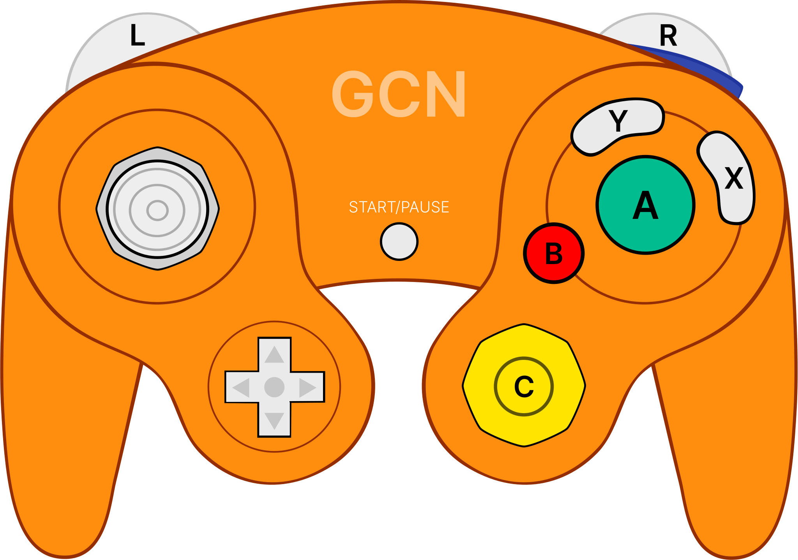
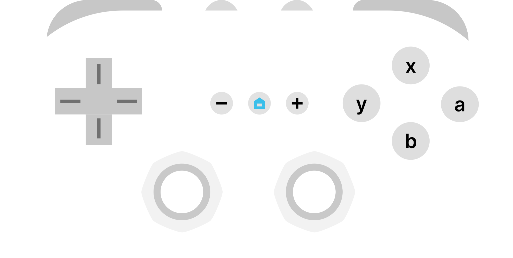
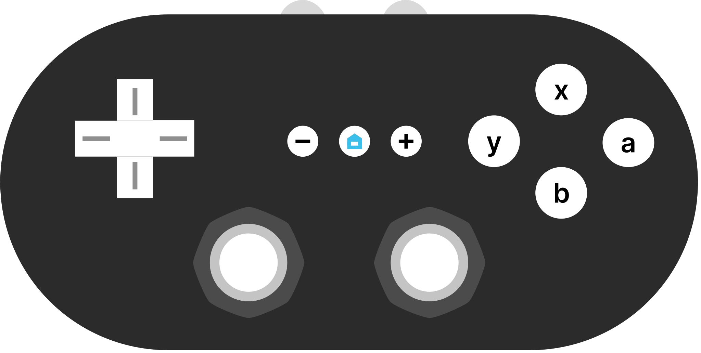
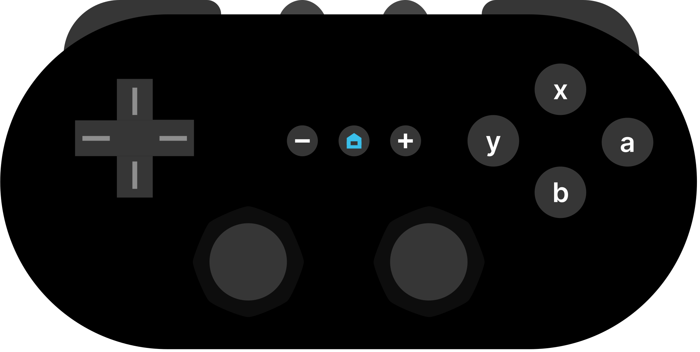

# Changelogs for ControllerOverlays

## v1.0.0

- First public release

## v1.0.1

- Added type `wiiClassicController` and style `wcc`

## v1.0.2

- Added brand-new configuration menu to guide the user to getting the correct URL prepared
- Completely overhauled the types and styles system (now skins are a thing)

### New skins in v1.0.2

- `gcn`:
  - `black`   
  
  - `indigo`   
  
  - `silver`   
  
  - `orange`   
  
  - `aqua`   
  
- `n64`:
  - `gray`   
  
  - `black`   
  
- `nsp`:
  - `gray`   
  
- `wcc`:
  - `white`   
  
  - `gray`   
  
  - `black`   
  