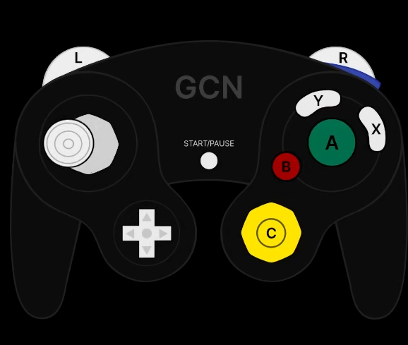
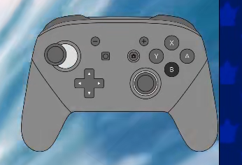
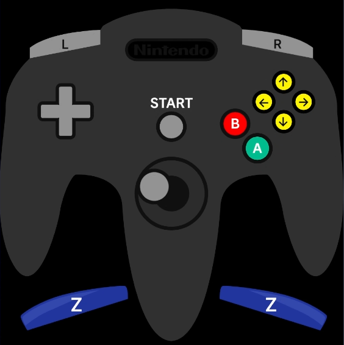

# Controller Overlays

This is a basic HTML app to display a controller overlay SVG image and control it with your controller. Intended to be used with OBS and other software.

## Setup

I'm going to admit that this thing is a bit of a mess, but here's what you should know:

- Open index.html with Live Server
- Configure options by changing `type` and `style` URL parameters (e.g. `http://localhost:5500/?type=gameCube&style=gcn`)

## Improving

There's probably a much better way of importing SVGs than placing them inside of divs like that, but I was trying to take the easy route to make this quickly. It's pretty modular so you can add your own buttons and overlays if you know some web development skills.

## Compatibility

- Works on Chrome, and as such OBS' browser source.
- Doesn't work on Firefox (my main browser) due to the gamepad library being used not accepting the specific gamepad implementation

## Library

This now uses [gamepad.js](https://github.com/Tom32i/gamepad.js) instead of [Controller.js](https://github.com/samiare/Controller.js) and [gamecontrol.js](https://github.com/alvaromontoro/gamecontroller.js) as I needed exact gamepad inputs which I couldn't figure out with the other libraries.

## Controller Support

There are a couple built-in types and styles to configure, here are some examples:

`?type=xbox&style=nsp` - Uses Xbox controller as input source, and shows a nintendo switch pro controller.
`?type=gameCube&style=gcn` - Uses GameCube controller as input source (only Mayflash adapter GameCube inputs are set up at the moment), and shows a GameCube controller.

## Examples of Use

- GameCube  
  

- Nintendo Switch Pro Controller    
  

- Nintendo 64 Controller (it's a bit janky but it works)
  